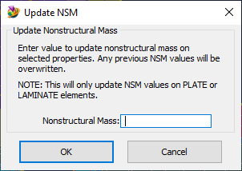

# Update-Plate-and-Laminate-Non-Structural-Mass
Add or change the non-structural mass on multiple properties at once..

See also: [How to use Femap Scripts](https://github.com/aaronjasso/How_to_use_Femap_Scripts) and [The List of my Femap Scripts](https://github.com/aaronjasso/My-Femap-Scripts)

---

Changing non-structural mass (NSM) values one property at a time is slow and tedious. This program allows the user to update NSM values on any number of properties all at once. The user is prompted to select the properties to update, and a dialog is launched where the new NSM is entered.

Only PLATE and LAMINATE PLATE properties are updated, as these are what I use most often. If other area elements are needed they may be added in the future. Open an issue or (or add them yourself and submit a Pull Request) if you need additional area elements like shear panels or membrane elements.
